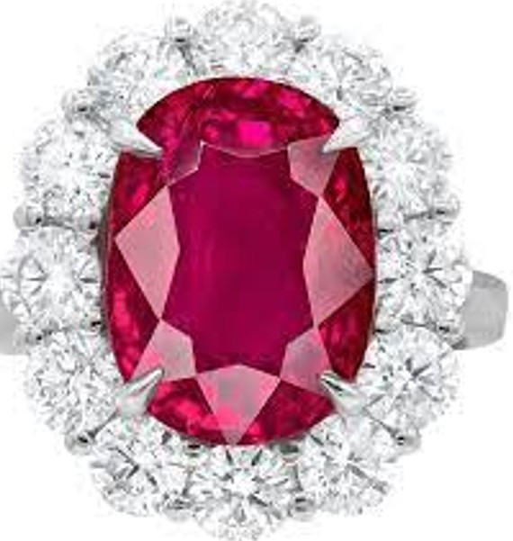

<html lang="en">
<head>
    <meta charset="UTF-8">
    <meta name="viewport" content="width=device-width, initial-scale=1.0">
    <title>Jewelry Fashion</title>

    <link href="https://fonts.googleapis.com/css?family=Roboto:wght@400;700&display=swap" rel="stylesheet">

    <link rel="stylesheet" href="style.css">

    <link rel="icon" type="image/x-icon" href="image/jewelry1.jpg">

    
</head>

<body>
    

        <marquee behavior="slide" direction="up" scrollamount="1">
            
        </marquee>

        <h1 style="color:gold; background-color: #212f3c;">
            <marquee behavior="scroll" direction="right" scrollamount="8">
                
                Cambodia Natural Gemstones
            </marquee>
        </h1>
    

    <a href="https://goldprice.org/">Cambodia Natural Gemstones</a>

    

        Our team of design consultants guides you through each step of designing the perfect ring. Get expert advice and guidance on your diamond or gemstone choice and ring design. Free Sketch Design. Diamond jewellery, Diamond Jewelry Set, Diamond Jewelry Designs, Diamond Bracelet Design, Diamond Bracelet, Gold Bracelet, Simple Gold Bracelet.
    

    <h2 style="color:gold; background-color:#212f3c;">
        
        Gold Collection
    </h2>
    

        Gold Cast Bar 1 Kg (999.9), Gold Grain 1000 Grams (995.0) (999.9) Purity. Pure gold has 24 carats - that is, 24/24 parts by weight of gold - and thus a fineness of 999.9. Some mints and refineries...
    

    

        <h2>Cambodia Gold 99.99</h2>
    

    

        

            
            
Natural Cambodia Mine

        

    

    

        

            
            
Gold 9999

        

    

    

        

            
            
Natural Gold

        

    

    

        

            
            
Gold Made in Cambodia

        

    

    

    <h2 style="color:gold; background-color:#212f3c;">
        
        Natural Diamonds
    </h2>
    

        Most natural diamonds have ages between 1 billion and 3.5 billion years. Most were formed at depths between 150 and 250 kilometers. Natural Diamonds is the destination for all things natural diamonds. Get diamond style & engagement ring inspiration.
    

    

        <h2>Natural Diamond</h2>
    

    

        

            
            
Natural Pink Diamond

        

    

    

        

            
            
Natural Brown Diamond

        

    

    

        

            
            
Natural Blue Diamond

        

    

    

        

            
            
Natural Color D Diamond

        

    

    

    <h2 style="color:gold; background-color:#212f3c;">
        
        Rings
    </h2>
    

        Necklaces, Bracelets, Earrings, Rings, Anklets.High-Quality Jewellery For Women - Personalised Jewellery Quality Guaranteed. Free Worldwide Shipping.
    

    

        <h2>Rings</h2>
    

    

        

            
            
Natural Diamond Ring

        

    

    

        

            
            
Natural Pailin Sapphier

        

    

    

        

            
            
Natural Pailin Rubby

        

    

    

        

            
            
Gold 75% Ring

        

    

    

    <h2 style="color:gold; background-color:#212f3c;">
        
        Earrings
    </h2>
    

        Meet timeless, twinkling drop earrings, gold hoop earrings, and more ade to mix, match, and inspire. From a simple, sparkly studs earring to stackable gold Earrings are one of the most timeless and versatile pieces of jewelry. They have been worn by women for centuries and have evolved into a must-have accessory
    

    

        <h2>Earrings</h2>
    

    

        

            
            
Cambodian Ear Rings

        

    

    

        

            
            
New Design Ear Rings

        

    

    

        

            
            
Ear Rings For Lady

        

    

    

        

            
            
Old Style Ear Rings

        

    

    

    <h2 style="color:gold; background-color:#212f3c;">
        
        Necklaces
    </h2>
    

        Discover our Range of Diamond Bracelets. Timeless Bespoke In-house and International Designs. Luxury Specialists. Bridal Jewellery. Specialty Diamonds. Exclusive Collections. Iconic Jewellery
    

    

        <h2>Necklaces</h2>
    

    

        

            
            
Cambodian Necklace

        

    

    

        

            
            
Gold Cambodian Necklace

        

    

    

        

            
            
Sapphier Necklace

        

    

    

        

            
            
Natural Gemstone Necklace

        

    

    

    <h2 style="color:gold; background-color:#212f3c;">
        
        Bracelets
    </h2>
    

        Find sterling silver bracelets and cuffs with gemstones at Sonara Jewelry. Our Competitive Pricing Strategy on Our Wholesale Sterling Silver Jewelry Will Not Be Beat. Wholesale Jewelry. Excellent Quality Diamond. Same Day 2-day Shipping. Diamond District LA. Styles: Opal Jewelry
    

    

        <h2>Bracelets</h2>
    

    

        

            
            
Gold 99 Bracelet

        

    

    

        

            
            
Bracelet Pailin Sapphier

        

    

    

        

            
            
Bracelet Pailin Rubby

        

    

    

        

            
            
Bracelet Diamond

        

    

    

    <h2 style="color:gold; background-color:#212f3c;">
        
        Anklets
    </h2>
    

        Some of the popular anklets for women available on Etsy include: anklets for women sterling silver, anklets for women boho, anklets for women beach, toe rings
    

    

        <h2>Anklets</h2>
    

    

        

            
            
Gold Anklet for Kids

        

    

    

        

            
            
Cambodia Anklet for Lady

        

    

    

        

            
            
Gold Anklet Women

        

    

    

        

            
            
Anklet 75% for Lady

        

    

    
    

        
Tel: 077778647 - 070778647

        
Telegram: @teavchhunnan

        
ABA QR

    

    

        
    

</body>
</html>
